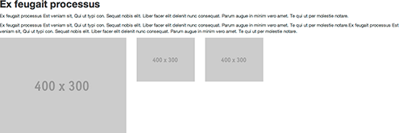
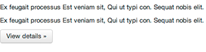
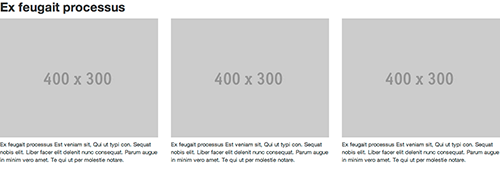
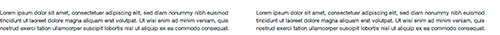
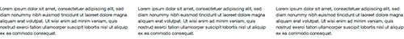

The [CKEditor](http://http://ckeditor.com/) is a WYSIWYG (What You See Is What You Get) text editor with basic HTML features. 

## Config

The configuration of Ckeditor is held in `config/main.php` under `params => `ext.ckeditor.options`, for more details see the CKEditor documentation.

You can modify the templates and styles used in Ckeditor, just by modifying the files in `www/themes/frontend/ckeditor`.

## Styles
Phundament provides some CSS styles from Twitters Bootstrap.

Create a link by clicking on the hyperlink button and inserting an url. Mark the link and click on the styles dropdown menu. As you can see it's depends on the marked element which styles you can add. E. g. only if you marked linked text you can choose button styles in the dropdown menu.

## Images

### Include images in CKEditor

To include images from your Media Browser move your cursor to the position you want to add the image. Click the image button at the top. Then click 'Browse Server' and choose the requested format. Click on the image. Confirm the dialog. 

### Change Properties

To change the properties of an image you have to mark it and to click the images button. There you can set the URL, alternative Text (alt), width, height, border, link, ...

*TODO*

## Templates

Templates help you to structure your page and can give you some ideas how to model your site.

Click on the button for templates and check them out. Currenty there are seven different templates which are presented below.

Don't forget to use the Fancy Box widget for them if you want this effect for your images.

### Headline, text, thumbnail

### Text, button

### Headline + 3x images with text

### Empty columns

You can choose between one and four divs.

###1 column

###2 columns

###3 columns

###4 columns

