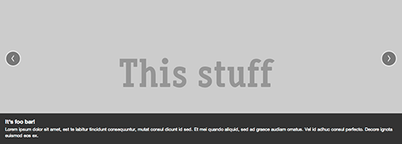
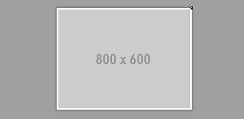

Currently you can use three different widgets with Phundament to create your sites content. All widgets are responsive, try it on your mobile device.

## Widget Container

tbd: `varyByRequestParam`

## Basic HTML Widget

This is a basic widget with no special function. You can paste any HTML code there.

## Bootstrap Carousel

The Carousel widget includes Bootstrap Carousel to create nice slideshows. If you created this widget you can set the properties image source, width and height for each picture by filling the fields in the JSON editor.

You can use this JSON string as reference. Copy this code, click on 'Switch to text input' and paste it there. If you switch back to JSON editor you can see the properties in a more structured way. Try to change the images and the description text.

	{
	  "prevLabel":"‹",
	  "nextLabel":"›",
	  "slide":"1",
	  "displayPrevAndNext":"1",
	  "items":{
	    "0":{
	      "image":"http://placehold.it/1400x800&text=This+stuff",
	      "label":"It's foo bar!",
	      "caption":"Lorem ipsum dolor sit amet, est te labitur tincidunt consequuntur, mutat consul dicunt id sed. Et mei quando aliquid, sed ad graece audiam ornatus. Vel id adhuc consul perfecto. Decore ignota euismod eos ex."
	    },
	    "1":{
	      "image":"http://placehold.it/1400x800&text=rockz!",
	      "label":"Sup?",
	      "caption":"Lorem ipsum dolor sit amet, est te labitur tincidunt consequuntur, mutat consul dicunt id sed. Et mei quando aliquid, sed ad graece audiam ornatus. Vel id adhuc consul perfecto. Decore ignota euismod eos ex."
	    }
	  },	  
	  "actionPrefix":"NULL",
	  "skin":"default"
	}

## Fancy Box

If you use the [Fancy Box](http://fancybox.net/) widget you are able to show images in a lightbox that overfloats overtop of web pages.

Images with JPG, PNG and GIF suffix which are in the href tag of an HTML element open with this nice Fancy Box jQuery effect.

In the widgets properties you can change the images types that are affected by Fancy Box.

`"selector":"[href$='.jpg'],a[href$='.png'],a[href$='.gif']"`

